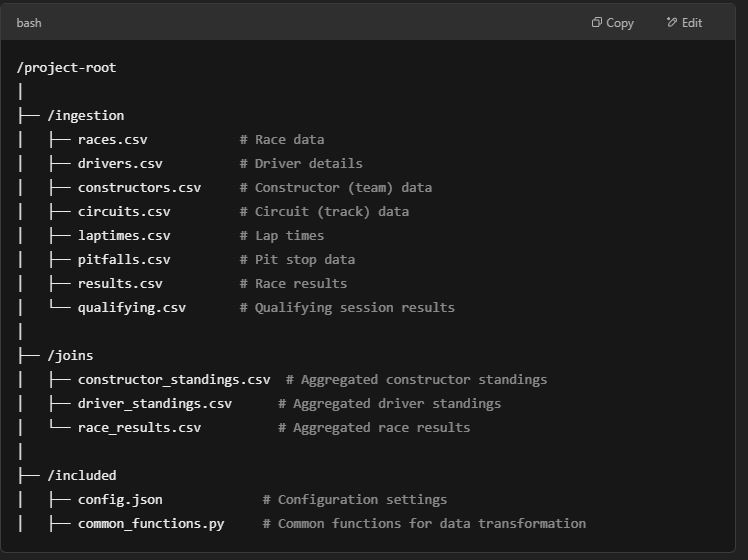

# End-to-End Formula 1 Data Engineering Pipeline with Azure Data Factory & Databricks 
## Project Overview
### This project demonstrates the integration of Azure Data Factory (ADF) and Databricks to build an end-to-end data pipeline for processing Formula 1 racing data. The pipeline handles data ingestion, transformation, and storage using Delta Lake for optimized performance.

Technologies Used
* Azure Data Factory (ADF)

* Databricks (Apache Spark)

* Delta Lake

* Azure Data Lake Storage (ADLS)

* Python (PySpark for data transformation)

##Key Features

* Data Ingestion: Raw data is ingested from CSV files containing race, driver, constructor, and lap times data.

* Data Transformation: Data is processed and transformed using PySpark in Databricks.

* Data Storage: Processed data is stored in Delta Lake format for scalability and optimized querying.

## Folder Breakdown:
/ingestion: Contains the raw data files (CSV format) related to Formula 1 races, including information on races, drivers, constructors, lap times, pit stops, results, and qualifying sessions.

/joins: Contains the aggregated data files after performing transformations, including constructor standings, driver standings, and race results.

/iculed: Contains configuration files and common functions that are used across the project, including general settings and reusable Python functions.

/notebooks: Contains Databricks notebooks for data transformation and analysis.

# Key PySpark Functions Used

read.json(), read.csv(), read.parquet() – Loading data from various file formats.

withColumn(), withColumnRenamed() – Adding and renaming columns in DataFrames.

select(), selectExpr() – Selecting and querying specific columns.

filter(), where() – Filtering data based on conditions.

groupBy().agg() – Performing aggregations like sum, count, avg, etc.

join() – Merging multiple DataFrames.

dense_rank().over(Window) – Using window functions for ranking.

StructType(), StructField() – Defining explicit schema for DataFrames.

printSchema() – Displaying the structure of DataFrames for validation.

# What I Learned
Delta Lake: Optimized data storage with ACID transactions.

Data Pipeline Automation: Orchestrated workflows using Azure Data Factory.

PySpark Transformations: Gained hands-on experience with Apache Spark for big data processing.
